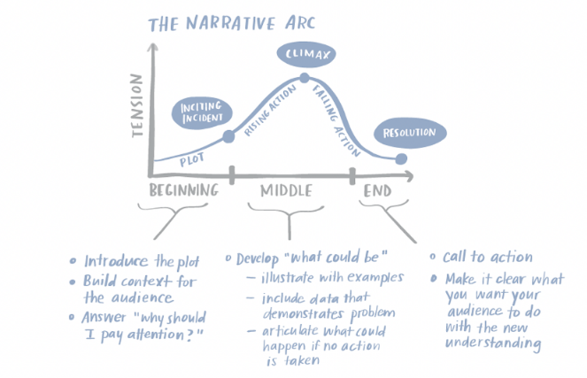
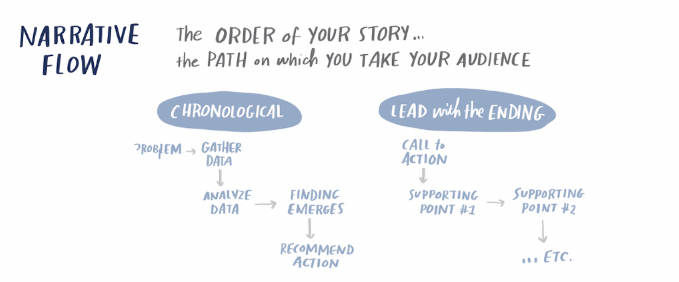
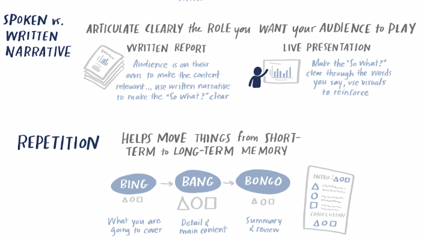

# STORYTELLING WITH DATA

```
"Don't simply show your data, tell a story with it!" - cole nussbaumer
```
This is a repository of personal studies on "storytelling with data", the main source is [Cole Nussbaumer Knaflic's book](http://www.storytellingwithdata.com/book/downloads) with the same name, others repositories are the [Dartmouth course](https://github.com/ContextLab/storytelling-with-data) and [@empathy87's](https://github.com/empathy87/storytelling-with-data) personal learning.
<br><br>

1. First Step - Context
    <details>
      <summary>Read</summary>
    <b>The first step is to understand some things about the process you are working on. You can group this information into a doc to guide you through this process.</b><br><br>
    <b>Exploratory vs. explanatory analysis</b><br>
    Exploratory analysis is what you do to understand the data and figure out what might be noteworthy or interesting to highlight to others.<br>
    When we’re at the point of communicating our analysis to our audience, we really want to be in the explanatory space, meaning you have a specific thing you want to explain, a specific story you want to tell.
    <br>
    <br>
    <b>Who, what, and how</b><br>
    Who - Sometimes this means creating different communications for different audiences.<br>
    What - What do you need your audience to know or do? <br>
    How - What data is available that will help make my point? Data becomes supporting evidence of the story you will build and tell.
    <br>
    <br>
    </details>
  
2. [Second Step - Display](https://github.com/gabriellearruda/storytelling-with-data/blob/main/display.md)
  
3. Third Step - Story
    <details>
        <summary>Read</summary>
    <b>Finally, it is necessary to summarize everything for presentation in story format.</b><br><br>
    "A good story <b>grabs your attention</b> and takes you on a journey, evoking an emotional response. In the middle of it, you find yourself <b>not wanting to turn away or put it down</b>. After finishing it—a day, a week, or even a month <b>later—you could easily describe</b> it to a friend."<br><br>
    <b>Constructing the story</b><br>
    
    <br>
    <b>The beginning</b> - In his book, Beyond Bullet Points, Cliff Atkinson outlines the following questions to consider and address when it comes to setting up the story:<br>
    1. The setting: When and where does the story take place?<br>
    2. The main character: Who is driving the action? (This should be framed in terms of your audience!)
    3. The imbalance: Why is it necessary, what has changed?<br>
    4. The balance: What do you want to see happen?<br>
    5. The solution: How will you bring about the changes?<br>
    <b>The middle</b> - Some ideas for content that might make sense to include as you build out your story and convince your audience to buy in:<br>
    * Further develop the situation or problem by covering relevant background.<br>
    * Incorporate external context or comparison points.<br>
    * Give examples that illustrate the issue.<br>
    * Include data that demonstrates the problem.<br>
    * Articulate what will happen if no action is taken or no change is made.<br>
    * Discuss potential options for addressing the problem.<br>
    * Illustrate the benefits of your recommended solution.<br>
    * Make it clear to your audience why they are in a unique position to make a decision or drive action.
    <b>The end</b> - Finally, the story must have an end. End with a call to action.<br>
    <br><br>
    <b>Narrative flow: the order of your story</b><br>
    
    <br>
    <br><br>
    <b>Spoken vs Written</b><br>
    
    <br>
    <br><br>
    <b>Tactics to help ensure that your story is clear</b><br>
    <b>Horizontal logic</b> - One strategy is to have an executive summary slide up front, with each bullet corresponding to a subsequent slide title in the same order. This is a nice way of setting it up so your audience knows what to expect and then is taken through the detail. Checking for horizontal logic is one approach to test whether the story you want to tell is coming through clearly in your deck.<br>
    
    <br>
    <b>Vertical logic</b> - Vertical logic means that all information on a given slide is self‐reinforcing.Employing horizontal and vertical logic together will help ensure that the story you want to tell comes across clearly in your communication. <br>
    <b>Reverse storyboarding</b> - You take the final communication, flip through it, and write down the main point from each page. The resulting list should look like the storyboard or outline for the story you want to tell. If it doesn’t, this can help you understand structurally where you might want to add, remove, or move pieces around to create the overall flow and structure for the story that you’re interested in conveying.<br>
    
    <br>
    
    <b>A fresh perspective</b> - Once you’ve crafted your communication, give it to a friend or colleague. It can be someone without any context, ask them to tell you what they pay attention to, what they think is important, and where they have questions. <br>
    <br><br>
    </details>
    
4. Dashboards Consideration
    <details>
        <summary>Read</summary>
      "Dashboards, are sort of a sepecific different use case as well. And when it comes to dashboards, if you really are wanting to allow your audience to dig and come up with their own stories then you actually want to stay away from some of the stuff that we talk about here today. Because as soon as you use color, especially, to draw your audience's to one story, it actually makes any other potential stories much harder to see. So dashboards, you want to think about designing in grays when you can or using color only as categorical differentiator, not as a visual cur that says, draw attention here. <br><br>
      Dashboard for me often fit in exploratory, but I think ofthen get sort of tried to be used for the explanatory. When you find something interesting thing, then instead of using the dashboads to communicate that, my view is that you should do the stuff we talked about today." - Adapted speech from [Storytelling with Data | Cole Nussbaumer Knaflic | Talks at Google](https://www.youtube.com/watch?v=Ov2x6NqxNqY) min: 33:13.
    </details>
    
5. Some Tools to Data Visualization
    <details>
    <summary>See</summary>
    
    - [DATAWRAPPER](https://www.datawrapper.de/)
      <p>Make static or interactive line charts, bar charts, pie charts, and maps with the German tool Datawrapper. Use the charts offline and online – digital charts are responsive.</p>
      <details>
        <summary>Preview</summary>
        
      </details>

    - [COGGLE](https://coggle.it/)
      <p>Analyse data by making mind maps and networks with Coggle.</p>
      <details>
        <summary>Preview</summary>
        
      </details>

    - [TABLEAU](https://www.tableau.com/)
      <p>Get the Viz of the Day delivered right to your inbox from Tableau Public, the world’s largest repository of data stories.</p>
      <details>
        <summary>Preview</summary>
        
      </details>

    - [Map Box](https://www.mapbox.com/)
      <p>This web application offers two basic basemaps, a street map and a terrain map, and allows the user to overlay data on roads and buildings and easily change the language.</p>
      <details>
        <summary>Preview</summary>
        
      </details>

     [Reference](https://en.rockcontent.com/blog/data-visualization-tools-for-journalists/)

    </details>  
    
    
6. Good Data Visualization Examples
    <details>
    <summary>See</summary>
    
    - [UK Government Income](https://informationisbeautiful.net/visualizations/uk-government-spending-incomes-outcomes/)
      <details>
        <summary>Preview</summary>
        
      </details>

    - [USA Left vs Right](https://www.informationisbeautiful.net/visualizations/left-vs-right-world/)
      <details>
        <summary>Preview</summary>
        
      </details>

    - [Cancer is not the end - Cancer não é o fim (PT)](https://informationisbeautiful.net/visualizations/gender-pay-gap/)
      <details>
        <summary>Preview</summary>
        
      </details>

    - [Harassment Tree - Arvore de Assédio (PT)](https://informationisbeautiful.net/visualizations/gender-pay-gap/)
      <details>
        <summary>Preview</summary>
        
      </details>

    - [Gender Pay Gap US/UK](https://informationisbeautiful.net/visualizations/gender-pay-gap/)
      <details>
        <summary>Preview</summary>
        
      </details>

    - [Who old Are You?](https://informationisbeautiful.net/visualizations/who-old-are-you/)
      <details>
        <summary>Preview</summary>
        
      </details>

    - [Spotify Billionaires](https://informationisbeautiful.net/visualizations/spotify-apple-music-tidal-music-streaming-services-royalty-rates-compared/)
      <details>
        <summary>Preview</summary>
        
      </details>

    - [China's economic - The Guardian](https://www.theguardian.com/world/ng-interactive/2015/aug/26/china-economic-slowdown-world-imports)
      <details>
        <summary>Preview</summary>
        
      </details>

    - [Bloomberg Billionaires Index](https://www.informationisbeautifulawards.com/showcase/64-bloomberg-billionaires-index)
      <details>
        <summary>Preview</summary>
        
      </details>
    </details>

<br>
<br>

[](https://www.youtube.com/watch?v=8EMW7io4rSI)
        **[Storytelling with Data | Cole Nussbaumer Knaflic | Talks at Google](https://www.youtube.com/watch?v=Ov2x6NqxNqY)**
        <br /> *Former Googler Cole Nussbaumer Knaflic teaches people how to turn data into high impact visual stories that stick with their audiences. Hear about the powerful strategies that were honed through her work on the People Analytics team and the data visualization course that Cole created at Google and taught at offices throughout the US and Europe.*


[Image sources: Cole twitter thread.](https://twitter.com/storywithdata/status/1283479691899351042)


