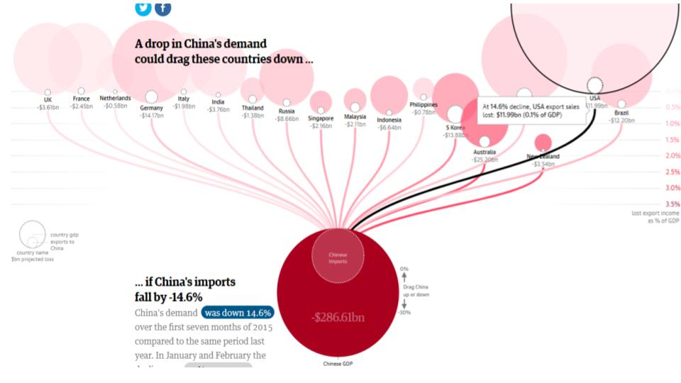

# STORYTELLING WITH DATA

```
"Don't simply show your data, tell a story with it!" - cole nussbaumer
```
This is a personal repository about "storytelling with data", the main source is [Cole Nussbaumer Knaflic's book](http://www.storytellingwithdata.com/book/downloads) with the same name, others repositories are the [Dartmouth course](https://github.com/ContextLab/storytelling-with-data) and [@empathy87's](https://github.com/empathy87/storytelling-with-data) personal learning.
<br><br>

1. Context
    <details>
      <summary>Read</summary>
    <b>Exploratory vs. explanatory analysis</b><br>
    Exploratory analysis is what you do to understand the data and figure out what might be noteworthy or interesting to highlight to others.<br>
    When we’re at the point of communicating our analysis to our audience, we really want to be in the explanatory space, meaning you have a specific thing you want to explain, a specific story you want to tell.
    <br>
    <br>
    <b>Who, what, and how</b><br>
    Who - Sometimes this means creating different communications for different audiences.<br>
    What - What do you need your audience to know or do? <br>
    How - What data is available that will help make my point? Data becomes supporting evidence of the story you will build and tell.
    <br>
    <br>
    </details>
  
2. [Display](https://github.com/gabriellearruda/storytelling-with-data/blob/main/display.md)
  
3. [Story]()

4. Dashboards Consideration
    <details>
        <summary>Read</summary>
      "Dashboards, are sort of a sepecific different use case as well. And when it comes to dashboards, if you really are wanting to allow your audience to dig and come up with their own stories then you actually want to stay away from some of the stuff that we talk about here today. Because as soon as you use color, especially, to draw your audience's to one story, it actually makes any other potential stories much harder to see. So dashboards, you want to think about designing in grays when you can or using color only as categorical differentiator, not as a visual cur that says, draw attention here. <br><br>
      Dashboard for me often fit in exploratory, but I think ofthen get sort of tried to be used for the explanatory. When you find something interesting thing, then instead of using the dashboads to communicate that, my view is that you should do the stuff we talked about today." - Adapted speech from [Storytelling with Data | Cole Nussbaumer Knaflic | Talks at Google](https://www.youtube.com/watch?v=Ov2x6NqxNqY) min: 33:13.
    </details>
    
5. Some Tools to Data Visualization
    <details>
    <summary>See</summary>
    
    - [DATAWRAPPER](https://www.datawrapper.de/)
      <p>Make static or interactive line charts, bar charts, pie charts, and maps with the German tool Datawrapper. Use the charts offline and online – digital charts are responsive.</p>
      <details>
        <summary>Preview</summary>
        
      </details>

    - [COGGLE](https://coggle.it/)
      <p>Analyse data by making mind maps and networks with Coggle.</p>
      <details>
        <summary>Preview</summary>
        
      </details>

    - [TABLEAU](https://www.tableau.com/)
      <p>Get the Viz of the Day delivered right to your inbox from Tableau Public, the world’s largest repository of data stories.</p>
      <details>
        <summary>Preview</summary>
        
      </details>

    - [Map Box](https://www.mapbox.com/)
      <p>This web application offers two basic basemaps, a street map and a terrain map, and allows the user to overlay data on roads and buildings and easily change the language.</p>
      <details>
        <summary>Preview</summary>
        
      </details>

     [Reference](https://en.rockcontent.com/blog/data-visualization-tools-for-journalists/)

    </details>  
    
    
6. Good Data Visualization Examples
    <details>
    <summary>See</summary>
    
    - [UK Government Income](https://informationisbeautiful.net/visualizations/uk-government-spending-incomes-outcomes/)
      <details>
        <summary>Preview</summary>
        
      </details>

    - [USA Left vs Right](https://www.informationisbeautiful.net/visualizations/left-vs-right-world/)
      <details>
        <summary>Preview</summary>
        
      </details>

    - [Cancer is not the end - Cancer não é o fim (PT)](https://informationisbeautiful.net/visualizations/gender-pay-gap/)
      <details>
        <summary>Preview</summary>
        
      </details>

    - [Harassment Tree - Arvore de Assédio (PT)](https://informationisbeautiful.net/visualizations/gender-pay-gap/)
      <details>
        <summary>Preview</summary>
        
      </details>

    - [Gender Pay Gap US/UK](https://informationisbeautiful.net/visualizations/gender-pay-gap/)
      <details>
        <summary>Preview</summary>
        
      </details>

    - [Who old Are You?](https://informationisbeautiful.net/visualizations/who-old-are-you/)
      <details>
        <summary>Preview</summary>
        
      </details>

    - [Spotify Billionaires](https://informationisbeautiful.net/visualizations/spotify-apple-music-tidal-music-streaming-services-royalty-rates-compared/)
      <details>
        <summary>Preview</summary>
        
      </details>

    - [China's economic - The Guardian](https://www.theguardian.com/world/ng-interactive/2015/aug/26/china-economic-slowdown-world-imports)
      <details>
        <summary>Preview</summary>
        
      </details>

    - [Bloomberg Billionaires Index](https://www.informationisbeautifulawards.com/showcase/64-bloomberg-billionaires-index)
      <details>
        <summary>Preview</summary>
        
      </details>
    </details>


<br>
<br>
  
[](https://www.youtube.com/watch?v=8EMW7io4rSI)
        **[Storytelling with Data | Cole Nussbaumer Knaflic | Talks at Google](https://www.youtube.com/watch?v=Ov2x6NqxNqY)**
        <br /> *Former Googler Cole Nussbaumer Knaflic teaches people how to turn data into high impact visual stories that stick with their audiences. Hear about the powerful strategies that were honed through her work on the People Analytics team and the data visualization course that Cole created at Google and taught at offices throughout the US and Europe.*


