# DISPLAY

How to dispose information?

- [Types](#type) 
- [Decluttering](#decluttering) 
- [Highlight](#highlight) 
- [Color](#color) 
- [Focus](#focus) 
- [Data visualizations and Risk Perception](#perception) 
- [Personal Experiences VS Facts](#experiencesvsfacts)  

[BACK](https://github.com/gabriellearruda/storytelling-with-data/blob/main/README.md) to Main File.

---
## Type

<table style="border-color: transparent;">
 <tbody style="border-color: transparent;">
  <tr style="border-color: transparent;">
   <td style="border-color: transparent;">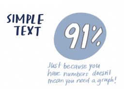
   <td style="border-color: transparent;">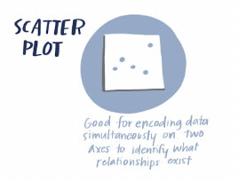
  </tr>
  <tr style="border-color: transparent;">
   <td style="border-color: transparent;">Simple Text - When you have just a number or two to share, simple text can be a great way to communicate.
   <td style="border-color: transparent;">Scatterplots - Can be useful for showing the relationship between two
things.
  </tr>
  
  <tr style="border-color: transparent;">
   <td style="border-color: transparent;">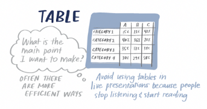
   <td style="border-color: transparent;">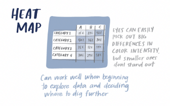
  </tr>
  <tr style="border-color: transparent;">
   <td style="border-color: transparent;">Tables - Using in a presentation can make you lose their ears and attention to make your point verbally.
   <td style="border-color: transparent;">Heatmap - Be sure when you leverage this to always include a legend to help the reader interpret the data.
  </tr>
  
  <tr style="border-color: transparent;">
   <td style="border-color: transparent;">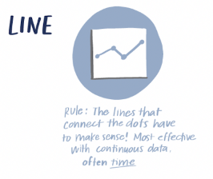
   <td style="border-color: transparent;">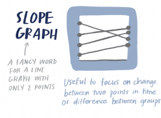
  </tr>
  <tr style="border-color: transparent;">
   <td style="border-color: transparent;">Line graph - Be consistent in the time points you plot.
   <td style="border-color: transparent;">Slopegraphs - Can be useful when you have two time periods or
points of comparison.
  </tr>
  
  <tr style="border-color: transparent;">
   <td style="border-color: transparent;">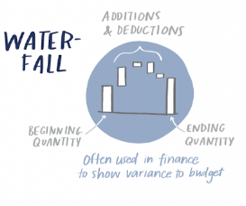
   <td style="border-color: transparent;">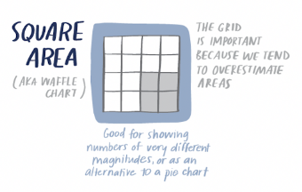
  </tr>
  <tr style="border-color: transparent;">
   <td style="border-color: transparent;">Waterfall chart - can be used to pull apart the pieces of a stacked
bar chart to focus on one at a time.
   <td style="border-color: transparent;">Square - Allows this to be done in a more compact way than
possible with a single dimension.
  </tr>
 </tbody>
</table>

 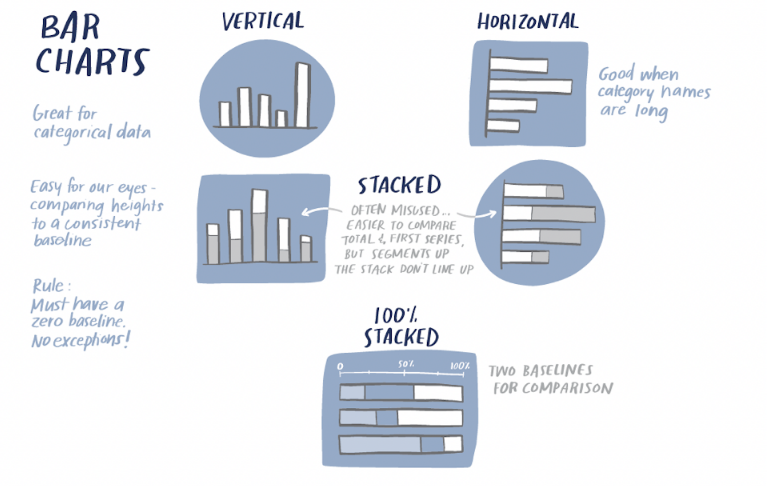 

## Decluttering
1. Remove chart border - Chart borders are usually unnecessary, as we covered in our discussion of the Gestalt principle of closure. 
2. Remove gridlines - If it will be helpful for your audience to trace their finger from the data to the axis, you can leave the gridlines. But make them thin and use a light color like grey. Do not let them compete visually with your data. 
3. Remove data markers - Remember, every single element adds cognitive load on the part of your audience. Here, we’re adding cognitive load to process data that is already depicted visually with the lines. This isn’t to say that you should never use data markers, but rather use them on purpose and with a purpose, rather than because their inclusion is your graphing application’s default. 
4. Clean up axis labels - Get rid of them, reducing their unnecessary burden on the audience’s cognitive load. 
5. Label data directly 
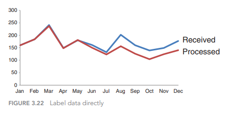 
6. Leverage consistent color  
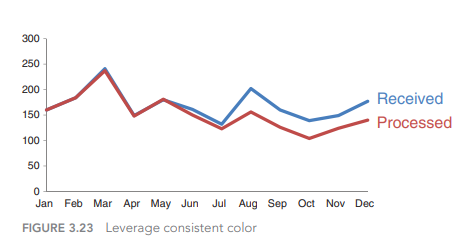 

## Highlight
-  Bold, italics, and underlining: Use for titles, labels, captions, and short word sequences to differentiate elements. Bolding is generally preferred over italics and underlining because it adds minimal noise to the design while clearly highlighting chosen elements. 
-  Italics add minimal noise, but also don’t stand out as much and are less legible. Underlining adds noise and compromises legibility, so should be used sparingly (if at all). 
-  CASE and typeface: Uppercase text in short word sequences is easily scanned, which can work well when applied to titles, labels, and keywords. Avoid using different fonts as a highlighting technique, as it’s difficult to attain a noticeable difference without disrupting aesthetics. 
-	 Color is an effective highlighting technique when used sparingly and generally in concert with other highlighting techniques (for example, bold). 
-	 Inversing elements is effective at attracting attention, but can add considerable noise to a design so should be used sparingly. 
-	 Size is another way to attract attention and signal importance. 

## Color
When used sparingly, color is one of the most powerful tools you have for drawing your audience’s attention. Resist the urge to use color for the sake of being colorful; instead, leverage color selectively as a strategic tool to highlight the important parts of your visual. 

<b>Colos blindness</b> 
8% of men and half a percent of women experience some form of color blindness. Most typically that manifests itself as difficulty in distinguing between shades of red and shades os green, which means you want to, in gereal avoid using shades of red and green together. 

<b>Contrast</b> 
Clear contrast can be a signal to our audience, helping them understand where to focus their attention. 
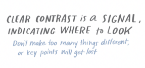

## Focus
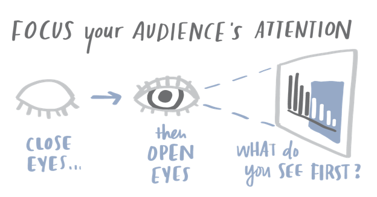 
Once you’ve crafted your communication, give it to a friend or colleague. It can be someone without any context, ask them to tell you what they pay attention to, what they think is important, and where they have questions. 

## Perception
[Impact of Visualization on Risk Perception and Decision-Making](https://arxiv.org/pdf/1910.09725.pdf) 
Data visualizations are standard tools for assessing and communicating risks. The study results show how we model risk perception and decisions for each visualization and provide a ranking to improve visualization selection.
 icons>pie>bar>triangle>circle 
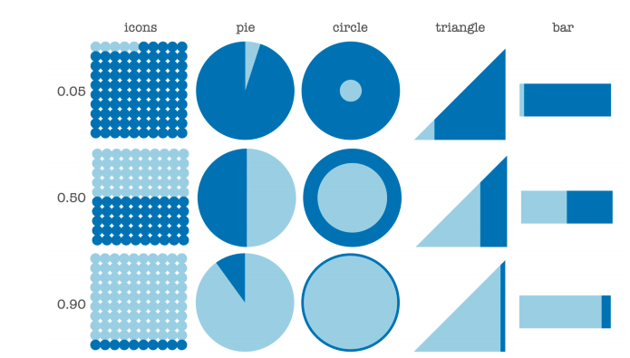

## ExperiencesVsFacts
[Personal experiences bridge moral political divides better than facts](www.pnas.org/content/118/6/e2008389118) 
This research provides a straightforward pathway for increasing moral understanding and decreasing political intolerance. These findings also raise questions about how science and society should understand the nature of truth in the era of “fake news.” In moral and political disagreements, everyday people treat subjective experiences as truer than objective facts. 
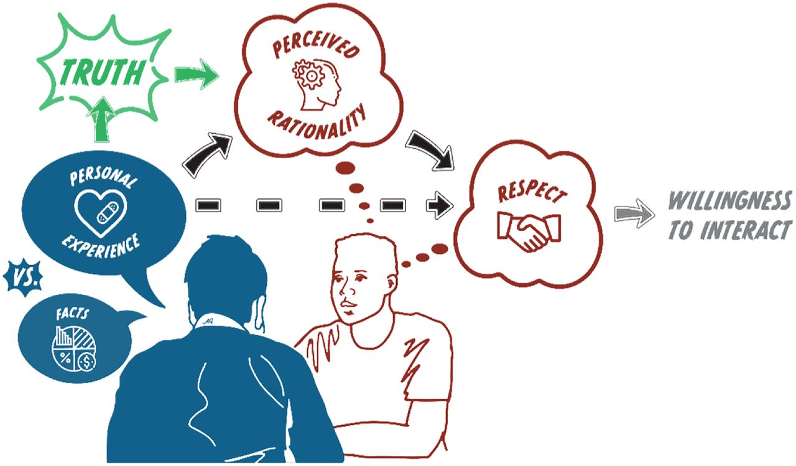

---
[BACK](https://github.com/gabriellearruda/storytelling-with-data/blob/main/README.md) to Main File.
